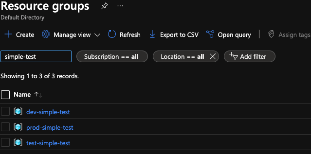
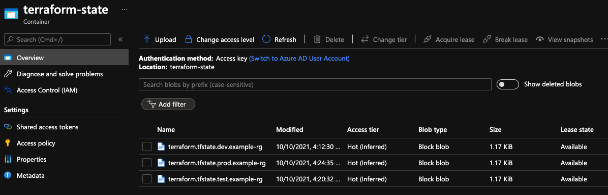

# Example

This example creates three different Azure Resource Groups that are prefixed with the environment name as indicated in the respective tfvars files.  All of the tfvars files are named for an environment in a similarly named directory; the actual name or location of the files does not matter as long as they are referenced properly.  The idea is that this directoy can be used as a template for new terraform projects that use the TerraformAzureBoostrap.sh

```
cp -R example/* ~/NEWTERRAFORMPROJECT
```

## Bootstrapping - from example directory
Executing the script three times as indicated below will create the resource groups and create three different blobs in the Azure Storage Container used to hold terraform state information; each blob is a key and has its own name based on the information in the tfvars file.



(per project/environment switch)

```
source env/TerraformAzureBootstrap.sh -f env/dev.tfvars
terraform apply -var-file env/dev.tfvars

source env/TerraformAzureBootstrap.sh -f env/test.tfvars
terraform apply -var-file env/test.tfvars

source env/TerraformAzureBootstrap.sh -f env/prod.tfvars
terraform apply -var-file env/prod.tfvars
```


